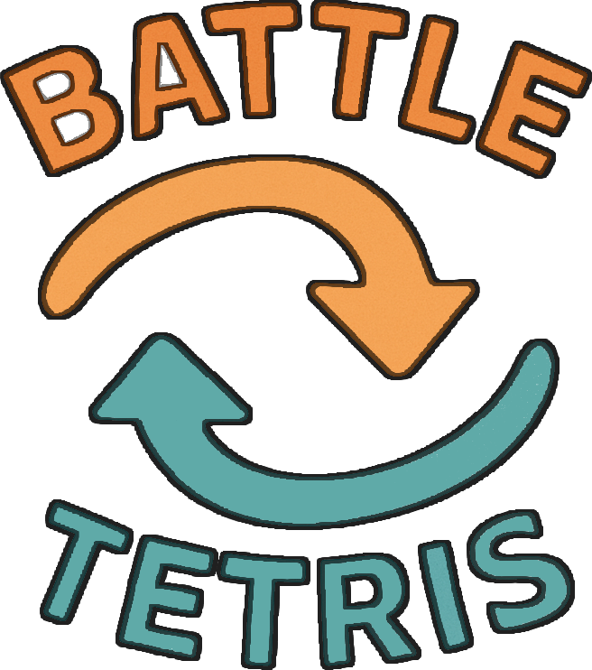

# 🕹 BattleTetris

[](https://www.oracle.com/java/)  
[](LICENSE)

<p align="center">
  
</p>


A competitive two‑player twist on the classic Tetris game: one player drops blocks from the top, the other from the bottom—meeting in the middle. It offers two modes; Normal and Wacky. Normal more closely resembles standard Tetris, while Wacky mode introduces the ability for falling pieces to merge together, creating a whole new dimension of strategy.

---

## 🎮 Controls

<table>
  <thead>
    <tr>
      <th>Action</th>
      <th>Player 1</th>
      <th>Player 2</th>
    </tr>
  </thead>
  <tbody>
    <tr>
      <td>Move Left</td>
      <td><code>A</code></td>
      <td>◀️ Arrow</td>
    </tr>
    <tr>
      <td>Move Right</td>
      <td><code>D</code></td>
      <td>▶️ Arrow</td>
    </tr>
    <tr>
      <td>Rotate (CW)</td>
      <td><code>W</code></td>
      <td>▲ Arrow</td>
    </tr>
    <tr>
      <td>Soft Drop</td>
      <td><code>S</code></td>
      <td>▼ Arrow</td>
    </tr>
    <tr>
      <td>Hard Drop</td>
      <td><code>V</code></td>
      <td><code>.</code> (Period)</td>
    </tr>
    <tr>
      <td>Hold</td>
      <td><code>C</code></td>
      <td><code>,</code> (Comma)</td>
    </tr>
    <tr>
      <td>Pause/Resume</td>
      <td colspan="2"><code>P</code> <strong>or</strong> Pause button</td>
    </tr>
    <tr>
      <td>Restart Game</td>
      <td colspan="2">Restart button</td>
    </tr>
    <tr>
      <td>Back to Menu</td>
      <td colspan="2">Menu button</td>
    </tr>
  </tbody>
</table>


---

## 🚀 Getting Started

### Prerequisites

- **Java 11** or higher  
- A modern IDE (IntelliJ IDEA, Eclipse) or a command‑line toolchain  

### Build & Run

1. **Clone the repo**  
   ```bash
   git clone https://github.com/ahmedmansour3548/BattleTetris.git
   cd BattleTetris
   ```
   
2. **Compile**  
   ```bash
	javac -d out src/**/*.java
	```
	
3. **Run**  
   ```bash
	java -cp out MainMenu
	```

### License
This work is released under CC0 1.0 Universal. See LICENSE for details.


Made with ❤️ for VARLAB 2024 Game Jam
